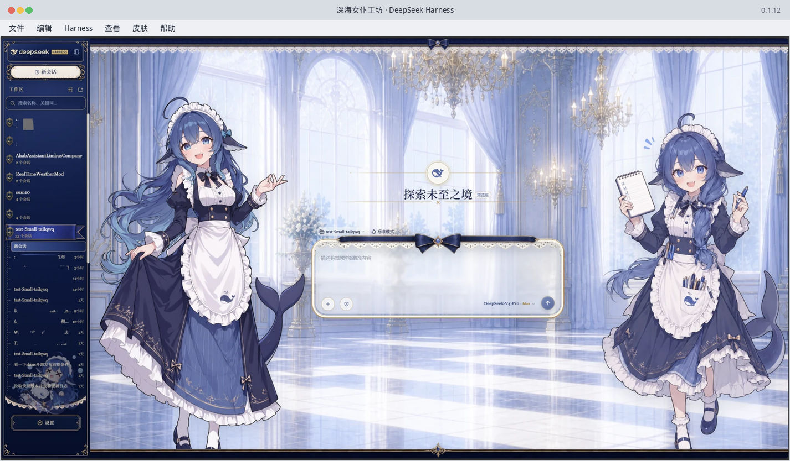

<div align="center">


# DeepSeek Harness Desktop

**基于官方 DeepSeek Harness 打造的 Electron 桌面端**  
Windows · Linux · macOS 开箱即用。引擎从 npm 安装官方 [`@deepseek-ai/dsh`](https://github.com/deepseek-ai/deepseek-harness)，不整仓拷贝官方源码。

[](https://github.com/zhuquan7237/zhuquan7237.github.io/releases/latest)
[](https://github.com/zhuquan7237/zhuquan7237.github.io/releases/latest)
[](https://github.com/zhuquan7237/zhuquan7237.github.io/releases/latest)

[主页 / 下载](https://dsh.zhuquan.xyz) ·
[关于作者](https://dsh.zhuquan.xyz/me.html) ·
[下载 0.2.2](https://dsh.zhuquan.xyz/dl/) ·
[Windows](https://dsh.zhuquan.xyz/dl/DeepSeek-0.2.2-win.exe) ·
[Linux tar.gz](https://dsh.zhuquan.xyz/dl/DeepSeek-0.2.2-linux-x64.tar.gz) ·
[macOS Apple Silicon](https://dsh.zhuquan.xyz/dl/DeepSeek-0.2.2-mac-arm64.dmg)



</div>

## 这是什么

官方 `dsh web` 已经很好用，但普通人还是得自己装 Node、克隆仓库、在终端里启动。这个项目做的是薄薄一层 **Electron 桌面壳**：

1. 给你一个能双击的安装包（Windows / Linux / macOS，x64 与 arm64，含 Intel Mac）
2. 启动时自动准备 Node，并从 npm 安装官方 `@deepseek-ai/dsh`
3. 把官方界面嵌进原生窗口：桌面快捷方式、图标、工作区、中文菜单

工具、插件、Plan/Agent、设置仍然全部来自官方 Harness。菜单 **Harness → 检查 Harness 更新** 只更新引擎，不必重装桌面软件。

作者：[朱泉 / Quan Zhu](https://dsh.zhuquan.xyz/me.html)，广东海洋大学材料科学与工程。

## 主要功能

| Desktop | 官方引擎，不整仓拷贝 |
| --- | --- |
| 把官方本地 Web UI 带到原生窗口。自动准备 Node、启动 dsh、记住工作区。Windows / Linux / macOS 都有安装包。 | 不把 `deepseek-ai/deepseek-harness` 整仓拷进仓库。官方发新版时，菜单里检查更新即可。 |
| **皮肤中心** | **国内网络与旧配置** |
| 默认「深海女仆工坊」打进安装包，离线也能用。右上角鲸鱼按钮可换皮或导入。 | 中文系统默认国内 npm 镜像。0.1.16 会尽量把旧版 API 密钥接过来。 |

## 和其他社区桌面版怎么选

搜「DeepSeek Harness Desktop」会看到好几个同名仓库。有的把官方源码整仓拷进自己的 GitHub，星标涨得快，但引擎更新要等他们再同步。这个项目只做薄壳。对照：[compare.html](https://dsh.zhuquan.xyz/compare.html)。

| | 这个桌面版 | 整仓拷贝官方源码的桌面版 |
| --- | --- | --- |
| 引擎 | 每次从 npm 装官方 `@deepseek-ai/dsh` | 仓库里那份拷贝 |
| 系统 | Windows、Linux、macOS（Apple Silicon + Intel） | 常见只有 macOS Apple Silicon 和 Windows |
| 默认皮肤 | 打进安装包 | 看各项目 |
| 旧版 API Key | 0.1.16 尽量从旧目录接过来 | 看各项目 |

GitHub 搜索名：[zhuquan7237/deepseek-harness-desktop](https://github.com/zhuquan7237/deepseek-harness-desktop)。请认准作者 **zhuquan7237**。

## 30 秒开始

| 系统 | 下载 | 说明 |
| --- | --- | --- |
| Windows | [DeepSeek-0.2.2-win.exe](https://dsh.zhuquan.xyz/dl/DeepSeek-0.2.2-win.exe) | 会创建桌面和开始菜单快捷方式。便携版快捷方式指向该 exe 本身。SmartScreen 选「更多信息 → 仍要运行」 |
| Linux | [x64 tar.gz](https://dsh.zhuquan.xyz/dl/DeepSeek-0.2.2-linux-x64.tar.gz) · [deb](https://dsh.zhuquan.xyz/dl/DeepSeek-0.2.2-linux-amd64.deb) · [arm64 tar.gz](https://dsh.zhuquan.xyz/dl/DeepSeek-0.2.2-linux-arm64.tar.gz) | 优先 tar.gz 或 deb。AppImage 在 Ubuntu 24.04 常缺 libfuse2，请用 tar.gz 或同目录的 `-no-fuse.sh` |
| macOS | [arm64 dmg](https://dsh.zhuquan.xyz/dl/DeepSeek-0.2.2-mac-arm64.dmg) · [Intel dmg](https://dsh.zhuquan.xyz/dl/DeepSeek-0.2.2-mac-x64.dmg) | 拖到「应用程序」。若提示已损坏，终端运行 `xattr -cr /Applications/DeepSeek.app`。说明：[mac.html](https://dsh.zhuquan.xyz/mac.html) |

```sh
# Linux
tar -xzf DeepSeek-0.2.2-linux-x64.tar.gz
./DeepSeek-0.2.2-linux-x64/DeepSeek
```

首次启动需要联网大约 1–3 分钟（下载 Node 和官方 dsh）。默认皮肤已打进安装包，不用再从 GitHub 拉。API Key 在官方界面里填写，或打开 [platform.deepseek.com](https://platform.deepseek.com)。从旧桌面版升级时，会尽量把 `%AppData%\DeepSeek`（以及更早的 `深度求索` / `~/.dsh`）里的密钥和配置接过来。中文系统或中国时区会默认走国内 npm 镜像。

请用 **0.2.2**。不要用 0.1.0–0.1.19。安装包优先从 [dsh.zhuquan.xyz/dl/](https://dsh.zhuquan.xyz/dl/) 下载。

## 皮肤中心与版权

打开软件后的宫殿大厅和双女仆，就是默认皮肤「深海女仆工坊」。**这套画面不是我画的。** 谢谢三位作者把这样完整的世界交出来。

对话窗口右上角有一枚 DeepSeek 鲸鱼按钮，点开后带过渡动画弹出皮肤列表，可快速切换，也可以从文件夹或 GitHub 地址导入新皮肤。不需要皮肤时，点列表里的「关闭皮肤中心」，或用菜单 **皮肤**；引擎设置里也有同样的开关。

**默认皮肤**是 [Small-tailqwq/dsh-deep-whale](https://github.com/Small-tailqwq/dsh-deep-whale) 里的「深海女仆工坊」（`maid-atelier` / `@dsh-external/dsh-client-ui-skin-maid-atelier`）。运行时文件打在安装包的 `desktop/resources/skins/maid-atelier`，离线也能用，**不再从 GitHub 下载**。不把皮肤的 TypeScript 源码或 [dsh-web-ui](https://github.com/zhu1090093659/dsh-web-ui) 脚手架打进仓库。

该皮肤是衍生创作，以 **CC BY-NC-SA 4.0**（署名-非商业性使用-相同方式共享）发布，**禁止商用**。署名链见上游 `maid-atelier/NOTICE`：

1. 一创 **上善** — 鲸鱼娘角色形象原作（[Pixiv](https://www.pixiv.net/users/62155430) · [Bilibili 上善无形](https://b23.tv/8h5L4xz)）
2. 二创 **ZipZipPipe / zipzip** — 加入 DeepSeek 元素的女仆鲸鱼娘二次设计（[Pixiv](https://www.pixiv.net/users/18604994)）
3. 三创 **Small-tailqwq** — 本皮肤（[dsh-deep-whale](https://github.com/Small-tailqwq/dsh-deep-whale)）

皮肤工程脚手架来自 [zhu1090093659/dsh-web-ui](https://github.com/zhu1090093659/dsh-web-ui)。本仓库只接入皮肤成品并保留上述署名。产品页也写了完整致谢：https://dsh.zhuquan.xyz/#skin

## 和「自己跑官方仓库」的差别

| | 官方仓库 | 这个桌面版 |
| --- | --- | --- |
| 怎么开始 | clone、装依赖、终端里 `dsh web` | 下载安装包，双击 |
| 引擎 | 你本地那份源码 | 每次从 npm 拉官方 `@deepseek-ai/dsh` |
| 更新 Harness | 自己 git pull / 重新构建 | 软件内检查更新 |
| 界面 | 浏览器 | 原生窗口 + 快捷方式 + 图标 |

这**不是** DeepSeek Harness 的 fork。源码在 [`desktop/`](./desktop/)。

## 仓库里还有什么

- [产品主页](https://dsh.zhuquan.xyz) — 按系统下载（`dsh.zhuquan.xyz`）
- [关于作者](https://dsh.zhuquan.xyz/me.html)
- [浏览器预览](https://dsh.zhuquan.xyz/app/) — 轻量网页版，不能替代完整 Harness
- [番茄钟](https://dsh.zhuquan.xyz/pomodoro.html)

本地运行桌面壳：

```sh
cd desktop
npm install
npm start
```

## 搜索

DeepSeek Harness Desktop、DeepSeek Harness 桌面版、DeepSeek Harness 桌面端、dsh desktop、dsh 桌面版、DeepSeek Harness 下载、DeepSeek Harness Windows、DeepSeek Harness Linux、DeepSeek Harness macOS、`@deepseek-ai/dsh`、Electron DeepSeek。
